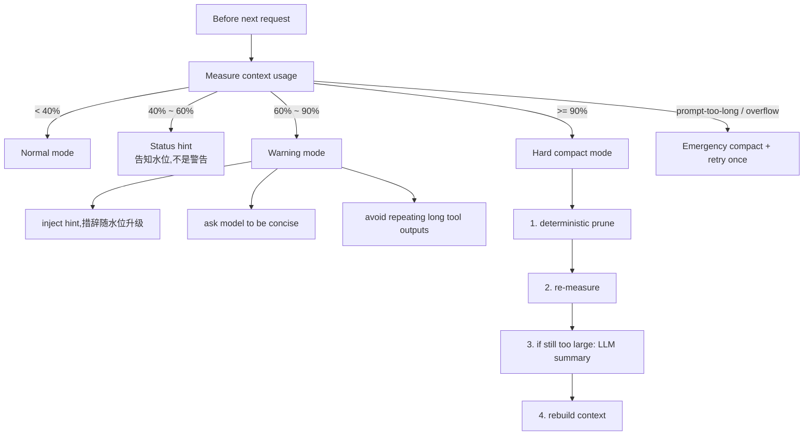

# compact 不是"总结一下":一套分层节流系统该怎么设计


最近观察日志， 发现频繁有模型上下文不够的问题。 发现是大家在频繁使用一个自有模型。这个自有模型上下文只有500k，但是胜在量大便宜。最近在优化这里，整理重新review了下 compact的设计。

问题不在"summary prompt 写得不够好",而在于**只有一层压缩手段,本身就是设计缺陷**。这里把我对 pi、deepseek、Claude Code 三家的思路梳理下,讲清楚一个真正扛得住长会话的 compact tool,应该长什么样。

---

## 一、如何进行compact

最直观的想法就是直接利用LLM做一次调用。生成summary的摘要。然后继续。

但是， compact的本质目标是在缩减上下文的同时，还要保证“模型不会变笨”即不丢失太多的上下文。不然就得非所愿了。

这里设计的核心思路只有一条：就是由软到硬处理。从对模型的提示压缩，到强硬prune + 硬约束到最后的兜底。是一个线性的过程。 

---

## 二、总体设计:compact 是分段处理,不是单点触发

很多人对 compact 的第一直觉是:设一个阈值(比如 90%),到了就触发一次 LLM 摘要。这其实是把"连续的膨胀过程"简化成了"单点判断", 上下文是一个渐进式的长大的过程，其实和我们日常的程序设计一样，不能靠到最后的兜底，在前面有苗头的时候就要有所手段。 所以学会分段，渐进式的思路在处理压缩上下文的时候非常重要。



这几档背后是一条成本梯度:

| 档位 | 触发条件 | 手段 | 成本 |
|---|---|---|---|
| Normal | < 40% | 什么都不做 | 零 |
| Status | 40%~60% | 只告知水位,不算警告 | 几乎零 |
| Warning | 60%~90% | 塞 hint,措辞随水位升级 | 几乎零(无 LLM 调用) |
| Hard compact | ≥ 90% | prune → 不够再 summary | prune 便宜,summary 贵 |
| Emergency | 已爆窗 | 更激进的 prune → 强制 summary → retry | 最贵,但兜底 |

---

## 三、90% 之前:用递进的提示分段减速

60% 才开始提醒,其实已经晚了一步。更合理的做法是把"提示模型"这件事,也按水位拆成两段,**越往上,措辞越严厉**。

### 40%~60%:只告知水位,不叫警告

这一段还不算压力区,只是让模型知道"现在什么水位",纯信息性的,不带任何要求:

```text
INFO — Context: 52% used (~48K tokens remaining).
```

当模型看到这条信息时，可能采取措施，也可能不采取，这是模型自己决定的，我们只是负责告知模型。 

### 60%~90%:正式 warning,而且措辞随水位升级

进了这一段才是真正的"软压缩"——不改写历史,只做一件事:**告诉模型你已经进入压力区,后面要节制**。

刚进 60% 的时候,措辞可以缓和:

```text
WARNING — Context: 63% used (~76K tokens remaining).
Compact at a natural stopping point. Save progress before compacting.
```

越往 90% 靠近,措辞要越明确、越急迫:

```text
CRITICAL — Context: 84% used (~32K tokens remaining).
Finish current step and compact soon. Save progress now.
```

很多对话不是从 30% 突然跳到 95%,而是有一段持续膨胀期。如果模型能在这段时间里自觉:

- 回答更短
- 不复述已经说过的内容
- 不整段搬运 tool_result
- 子任务做完只留短 context summary

后面的增长速度会慢很多。

记住这一层的分工:

> **hard compact 负责减肥,分段提示负责别再长胖太快——而且越接近阈值,催得越紧。**

---

## 四、90% 的 hard compact:顺序不能乱

到了 90%,不能再依赖模型自觉,系统要接管。内部顺序是固定的:

```text
1. 先保护 recent tail
2. 再 deterministic prune
3. re-measure —— 够了就停,不够再 summary
4. rebuild
```

这四步顺序,每一步换了都会出问题,拆开说。

### 为什么"保护 tail"必须在 prune 之前

prune 的规则是按内容特征判断的——重复的删、超长的截断——它并不知道"这条 tool_result 是不是刚刚发生、还在被依赖"。

如果不先划出一块"pruner 禁区",规则清理完全可能把**最近一步、模型还在用的那个大 tool_result** 当成"又大又旧"的东西处理掉,因为从规则角度看,它跟三步前那个已经过时的 tool_result 长得一样"大"。

一旦误伤,后果是模型下一步引用一个已经被截断的路径/结论做判断,出错或者要重新拉取一遍——等于白白多花一轮。所以顺序必须是:**先锁住热数据,再让规则清理去动剩下的部分**。

### deterministic prune 到底在删什么

这一步不靠 LLM 判断,只靠规则,目标是把"低风险、可规则化处理"的内容先缩掉。典型手法是**头尾截断**:

假设某一步 `read_file` 读了一个 500 行的文件,原始返回占了几千 token。截断后变成:

```text
[Lines 1-20]
import ...
... (前 20 行原文) ...

[... pruned: 460 lines omitted ...]

[Lines 481-500]
export default ...
... (后 20 行原文) ...
```

保留开头(定位信息)和结尾(结论/最近改动),中间换成一行 marker——marker 的作用是告诉模型"这里被裁过",避免它误判信息完整、也方便真要用时知道该重新去读全文。`grep` 的一堆匹配结果、超长 bash 日志,都是同一个套路。

### 为什么必须先 prune 再 summary,不能反过来

如果反过来——先让 LLM summary 整段旧历史,summary 完了再清理剩下的 tool_result——会有两个问题:

1. **这次 LLM 调用的输入本身就是臃肿的**。你在为那些"规则就能干掉的垛圾"付一次昂贵的 token 账单,输入越大,这次调用本身也越容易输出得又长又不稳,甚至有自己爆窗的风险。
2. **LLM 会被噪音污染判断力**。它本该只关注"真正需要理解的部分",结果混进了大量本可以确定性处理的原始 payload。

所以顺序必须是:

> **先用免费/低成本的方式排掉噪音,让贵的那一步(LLM)只处理真正需要理解和判断的部分。**

---

## 五、toolResultPruner:正式压缩之前的第一层过滤器

很多上下文膨胀,不是因为对话说了太多,而是旧的 `tool_result` 太大、太多、太重复。`toolResultPruner` 的职责就是在不调用 LLM 的前提下,先把这部分降下来。

三条设计原则:

1. **删 payload,不删结果语义**——一段很长的 bash 输出,真正值得保留的往往只是"执行了什么命令、成功还是失败、关键错误是什么、产物路径是什么",中间几千行成功日志可以先拿掉。
2. **优先处理只读工具结果**——文件内容可以再读,搜索结果可以再跑,网页可以再抓。这类内容删掉或缩短,风险远小于删除有副作用的结果。
3. **永远保留继续工作所需的最小证据**——tool name、tool input、status/exit code、error signature、artifact/id/path,这些不能动。

实际处理顺序建议是:

```text
1. 删重复结果(同工具同输入同结果,只留最新一次)
2. 截断超长结果(head/tail + pruned marker)
3. 长日志降级成"结论 + 证据"(失败留错误证据,成功留结论)
4. 大对象(blob/附件)降级成 metadata(名称/类型/大小/来源/引用 ID)
```

而下面这些,pruner 绝对不能碰:

- 最近 1~2 步还在使用的 tool_result
- 最新失败上下文
- 有副作用的执行结果
- 新生成的 ID、URL、路径、句柄
- 直接决定下一步行为的结果

一句话总结这一层:

> **一个好的 toolResultPruner,不负责理解任务本身,它只负责先把那些"又大、又旧、又可重建"的工具输出,从热上下文里安全地减掉。**

---

## 六、LLM compact 该产出什么:一份"够格"的 context summary

前面 hint 和 pruner 都还不是正式 compact。真正进入 LLM 压缩时,你要的不是随手"总结一下",而是**一份能让下一个模型直接接班的 context summary**。

### 第一步:换角色,不是加一句话

这一步很容易被忽略,但很关键——**它本质上是给这次调用换了一套完全独立的 system prompt,不是在原对话的 system prompt 后面追加规则**。

原因是:模型输入的还是一段"对话历史",如果不明确说清楚"你现在的角色是什么",模型会默认沿用平时的行为模式——继续扮演 assistant,接着往下推进任务。具体会翻车成:

- 继续解题,而不是停下来写总结
- 开始给用户建议
- 把 summary 写成一段叙事性散文
- 把已经被 pruner 删掉的长日志,又在 summary 里抄回来一份

所以 prompt 开头要先钉死身份:

```text
You are acting as a compaction engine for an AI assistant.
Do not continue the conversation.
Do not answer the user.
Output only a structured context summary for future continuation.
```

正常对话时,模型的角色是"帮用户做事的 assistant";compact 调用时,这是一次完全独立、单一目的的调用,角色被整个换成"compaction engine"。这样模型不会被"我一直是那个在帮你写代码的 assistant"这个历史身份带偏。

### 第二步:固定结构,不让模型自由发挥

不规定结构,输出通常会越写越散。最少保留这几个 section:

```text
Goal / Constraints / Done / In Progress / Pending
Key Decisions / Errors / Files-Commands-Artifacts
Next Step / Critical Context
```

这套结构回答的其实就是几个最核心的问题:现在要做什么、有什么限制、已经做到哪、接下来该干什么、哪些信息不能丢。

### 第三步:明确"不要抄回已 prune 的内容"

这条规则最容易被漏掉,但非常关键:

> **不要把已经 prune 掉的大载荷,又重新写回 compact summary。**

否则前面 toolResultPruner 做的所有工作就白费了。一份可以直接用的最小模板:

```text
You are acting as a compaction engine for an AI assistant.

Condense the conversation above into a structured context summary that allows
another model to continue the work with no loss of essential context.

Rules:
- Do NOT continue the conversation.
- Do NOT answer the user.
- Do NOT call tools.
- Output ONLY the context summary.
- Preserve exact file paths, function names, commands, error strings,
  identifiers, and configuration values when they matter.
- Exclude long raw tool outputs, repeated results, and stale
  intermediate reasoning.

## Goal / Constraints / Done / In Progress / Pending
## Key Decisions / Errors
## Files / Commands / Artifacts
## Next Step
## Critical Context
```

三层关系可以这样理解:hint 让模型之后别长太快,pruner 把旧的大的重复的工具结果先缩掉,context summary prompt 才把真正还要长期保留的状态,整理成结构化交接单。**context summary prompt 之所以有效,恰恰是因为在它之前,低价值 payload 已经被 prune 过了。**

---

## 七、compact 后为什么不能只留 summary

这是很多人第一次设计 compact 最容易犯的错——压完只留一段 summary。

真正最热的上下文,往往是最近那几步:最新用户消息、最新 assistant 结论、最新错误、最新 tool_result。所以压缩后的结构应该是:

```text
[boundary]
[context summary]
[recent tail]
```

而不是只有 `[one big summary]`。分工很简单:

> **summary 负责保留长期状态,tail 负责保留短期工作集。**

---

## 八、overflow 兜底:emergency compact 为什么也要先 prune

再好的阈值设计也不能保证永远不爆窗。爆窗时,系统会报错(prompt too long),但这**不代表 LLM 从此不能用了**——只是这一次"正常请求"因为 payload 太大被拒绝,emergency compact 是另一次专门用来抢救的调用。

```text
[Model request]
      |
      v
prompt-too-long / context-overflow ?
      |
      +---- yes ---> 1) preserve latest tail
                      2) run more aggressive prune   ← 纯规则处理,不调 LLM
                      3) if needed, force context summary  ← 这时才安全调 LLM
                      4) rebuild context
                      5) retry once
```

关键点在第 2、3 步的先后顺序:**LLM 调用本身也有输入长度限制**。如果这次请求已经因为太长被拒绝了,不能马上再发一次 LLM 调用去做 summary——因为输入还是那段过长的历史,一样会失败。

所以必须先用纯规则的方式(prune)把体积降到"LLM 能吃得下"的程度,这一步不受上下文窗口限制,可以在任意大小的输入上工作;体积降下来之后,第 3 步的 LLM summary 才能安全执行。

和 90% 那次 hard compact 相比,emergency 的区别是:90% 那次是**主动预防**、还有余量慢慢来;emergency 是**被动补救**、已经出错了才反应,所以 prune 要下更重的手,而且处理完必须重新发起刚才失败的那次请求——多了"retry"这一步。

> **90% hard compact 负责预防,emergency compact 负责抢救。**

---

## 加餐:把这套设计再往前推一步的几个工程直觉

前面讲的是骨架。如果你已经把这套分层 compact 跑起来了,再往下打磨,会碰到几个骨架之外的细节。这些不是推翻前面的设计,而是同一套思路往深处走了一步。

### 1. hint 不一定要单独占一条消息,可以顺着已有流量捎带过去

前面说 hint 是"塞一段提示文本",但没规定它一定要单独发一条消息。更省事的做法是:**把提示字段挂在下一次工具调用的返回结果里**,跟着已有的 tool_result 一起捎带过去,不额外占用一条消息位置。

这样模型看到提示的频率,天然就等于它调用工具的频率——不需要额外设计"什么时候该主动插一条提醒",复用已经存在的交互节奏就够了。

### 2. 截断不该头尾对半分,而是偏向尾部

文章前面举的截断例子是"开头一段+结尾一段",听起来是对半分。但更贴合实际的做法是:**大部分预算留给尾部**,比如 7 成给尾、3 成给头。

原因很直接:工具输出里,**报错信息和最终结论通常出现在最后**,开头往往只是命令、路径这类定位信息。所以截断时,头部留一小段"这是什么"就够了,真正值得保留的内容,大概率在尾部。

### 3. context summary 之前,先让模型打一份"不算数"的草稿

不要指望模型一步到位直接写结构化字段。更稳的做法是分两步:

1. 先让模型写一份**按时间顺序复盘整段历史**的草稿(类似"这段对话发生了什么,按顺序讲一遍")
2. 再基于这份草稿,提炼成最终的结构化 context summary

草稿本身不计入长度限制,最后也会被程序剥掉,不出现在真正保留的 context summary 里。它存在的意义只是给模型一个"先想清楚再总结"的中间台阶——直接要结构化输出,模型容易跳步骤、漏细节;先复盘一遍再提炼,产出会明显更稳、更完整。

### 4. recent tail 不一定要"挑几条保留",可以"整类清空,只留摘要"

前面说 recent tail 要保护最近的 tool_result,不能被 prune 误伤。但压缩之后重建上下文时,还有一种更彻底的做法:**不做"挑哪几条工具消息该留"的精细判断,而是把所有工具调用/工具结果类的消息全部清空,只保留用户说过的话和 context summary**。

这样做的好处是彻底规避了"删消息可能删断配对关系"的风险——你不需要判断"这条 tool_result 还要不要留、它跟哪条 tool_call 绑在一起",因为跟工具相关的结构化消息一条不留,该保留的信息已经写进摘要里了。牺牲一点"原始细节的精确复现",换来"重建逻辑不用处理任何边界情况"。

### 5. 换角色不是唯一解,也可以选择"不换身份,但收掉能力"

前面说 context summary prompt 要给这次调用换一套完全独立的身份设定。但如果你的调用链路依赖前缀缓存——这次压缩调用的前半段历史,跟主对话上一次调用完全一样,复用缓存能省下不少成本和延迟——那么整个换身份会打破这个前缀复用。

这时候有个折中方案:**system prompt 不换,但这次请求里直接不传任何工具定义**。模型没有工具可调,从接口层面就杜绝了"意外执行工具"的可能,不需要靠一句"别调工具"的指令去约束它,机制上比文字指令更硬。这是拿"角色隔离的干净程度"换"缓存复用的成本",两种设计都成立,取决于你更在意哪个。

### 6. 不一定要主动先 prune 再 summary,也可以反过来"乐观发送,失败再降级"

前面强调"先 prune 再 summary"是因为要避免让 LLM 处理臃肿的原始 payload。但如果你已经有一层**持续在运行、跟每次工具调用绑定的裁剪机制**——也就是说,超长的 tool_result 在产生的那一刻就已经被裁过一轮,不是等到 compact 才处理——那么走到 compact 这一步时,历史本身已经不算臃肿了,完全可以乐观地把整段直接发给 LLM 去总结。

只有当这次调用真的因为太长报错了,才逐步降级重试,优先级大致是:先丢图片(体积最大、对摘要价值最低)→ 再丢工具结果 → 最后丢最早的文本(保留最近的对话)。

这跟"先 prune 再 summary"不矛盾,只是把 prune 这一步挪到了更早、更高频的位置——变成一种"持续预防",而不是"临阵一次性处理"。持续预防做得够好,临阵那一步就可以更乐观。

### 7. 别只想"压缩一次",要想"压缩了很多次会怎样"

如果一个会话被压缩了不止一次,第二次压缩时,历史里已经包含了第一次压缩留下的 context summary。如果不做处理,这份旧内容会被当成普通历史内容,又被塞进第二次的摘要里——**摘要套摘要,越压越长,完全失去压缩的意义**。

所以在把历史喂给 LLM 之前,要先识别并跳过"上一次压缩留下的摘要",确保每一次压缩都只产出一份"从头到当前"的全新总结,而不是在旧摘要上面再叠一层。这个坑只有在长会话、多次压缩的场景下才会暴露,设计阶段很容易漏掉。

---

## 九、总结

如果把 compact 只看成一个 prompt 技巧,很容易设计成"快满了就让 LLM 总结一下"。但真正好用的 compact tool,是一个分层的上下文管理系统,同时处理四件事:

- **何时提醒**:60% hint
- **何时接管**:90% hard compact
- **怎么减载**:先 prune,再 summary
- **怎么兜底**:overflow 后 compact + retry

这里暗含了一个分层设计的思想。 非常值得学习。