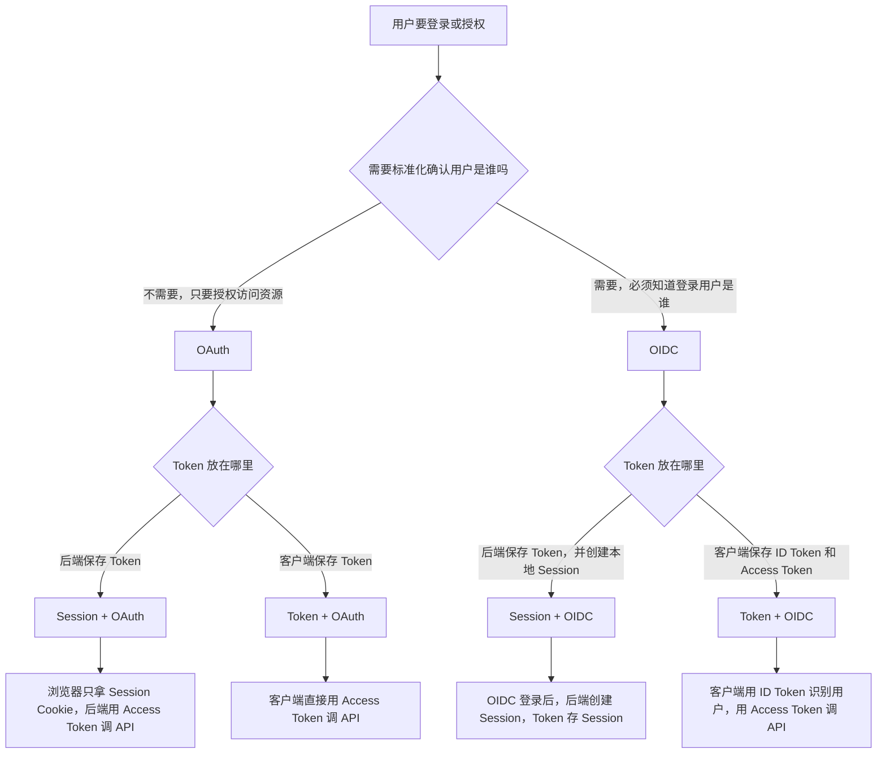
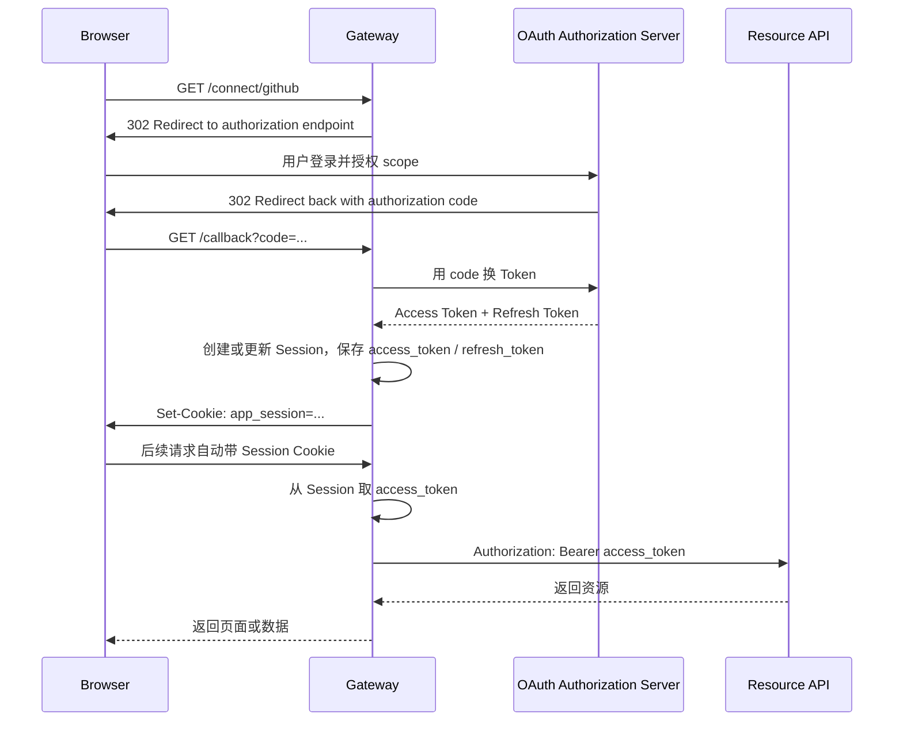
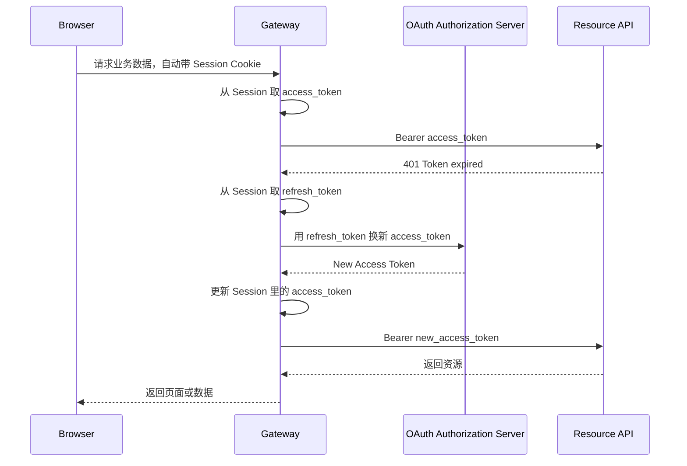
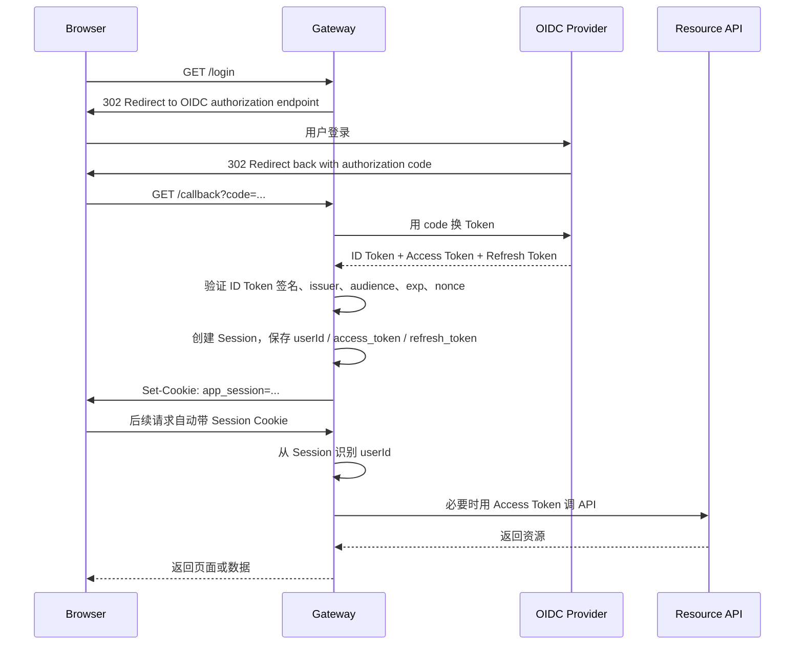
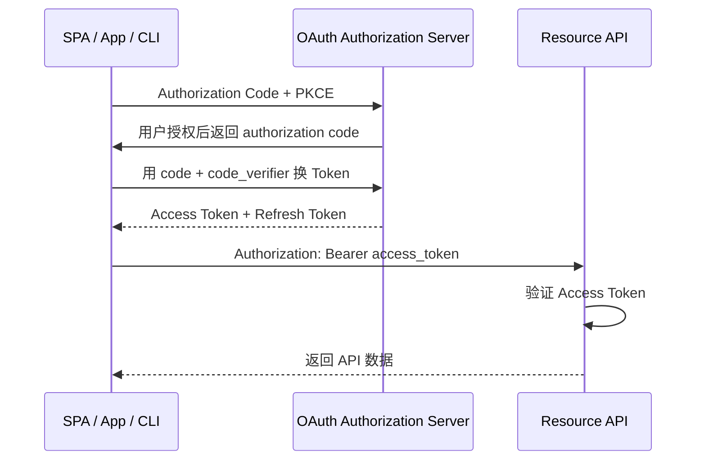
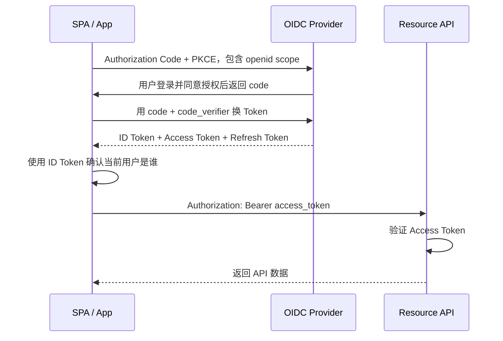

# Session、Token、OAuth、OIDC 的总体设计

先把层次分清楚。

真正的协议主线只有两类：

```text
OAuth：解决授权，客户端如何拿到 Access Token 去访问资源
OIDC：解决认证，在 OAuth 之上增加 ID Token，用来标准化说明用户是谁
```

而 Session 和 Token 不是和 OAuth/OIDC 平级的协议主线，它们负责的是系统内部怎么承载登录态和访问凭证：

```text
Session：应用后端怎样维持浏览器登录态
Token：客户端或后端怎样拿凭证访问 API
```

所以更准确的理解不是：

```text
Session vs Token
OAuth vs OIDC
```

而是：

```text
OAuth / OIDC：凭证怎么被标准化签发
Session / Token：凭证和登录态放在哪里、怎么被使用
```

Session 和 Token 不互斥。一个常见架构就是：

```text
Browser
  ↓ Cookie: app_session=abc123
Gateway
  ↓ 查询 Session
Session:
  userId: 10001
  access_token: xxx
  refresh_token: yyy
  expires_at: ...
  ↓ Authorization: Bearer access_token
Resource API
```

这里的 `Gateway` 可以先统一理解成“网关层”：它站在浏览器和后端 API 之间，负责登录入口、Session 查询、Token 保存、Token 刷新，以及代替浏览器调用后端 API。

这篇先按照这个模型理解：

> Refresh Token 存在服务端 Session 里，浏览器只持有 Session Cookie。

---

# 一张总览图



---

# 核心对象

## OAuth

OAuth 关心的是：

```text
某个客户端能不能代表用户访问某个资源？
能访问哪些 scope？
Access Token 怎么签发？
```

OAuth 的核心产物是：

```text
Access Token
Refresh Token
Scope
```

OAuth 本身不标准化回答：

```text
当前登录用户是谁？
用户的身份信息是什么格式？
```

## OIDC

OIDC 是建立在 OAuth 之上的登录认证协议。

OIDC 关心的是：

```text
当前登录用户是谁？
这个身份由哪个 Identity Provider 确认？
客户端如何标准化拿到用户身份？
```

OIDC 的核心产物是：

```text
ID Token
Access Token
Refresh Token
```

其中：

```text
ID Token：给客户端确认用户身份
Access Token：给 API 判断访问授权
Refresh Token：用于换取新的 Access Token
```

## Session

Session 关心的是：

```text
浏览器和应用后端之间，如何维持已登录状态？
```

典型形式是：

```text
Browser:
  Cookie: app_session=abc123

Server Session Store:
  abc123:
    userId: 10001
    access_token: xxx
    refresh_token: yyy
    expires_at: ...
```

浏览器不需要知道 Access Token 和 Refresh Token。它只需要每次请求自动带上 Cookie。

## Token

Token 关心的是：

```text
调用 API 时，用什么凭证证明这次请求被授权？
```

典型形式是：

```http
Authorization: Bearer access_token
```

Token 可以由浏览器、App、CLI 直接持有，也可以由 Gateway 后端持有。

---

# 1. Session + OAuth

典型场景：

```text
服务端 Web 应用访问第三方 API。
```

例如应用需要访问用户的 GitHub 仓库。

这里分工是：

```text
OAuth：用户授权应用访问 GitHub API
Session：应用自己维持浏览器登录态，并在 Session 里保存 Token
```

浏览器只持有应用自己的 Session Cookie，不直接持有 GitHub Access Token 或 Refresh Token。



这种模式的重点：

```text
Token 在服务端 Session 里
浏览器只处理 Cookie
后端代替用户调用第三方 API
```

如果 Access Token 过期：



---

# 2. Session + OIDC

典型场景：

```text
服务端 Web 应用使用 Google、Auth0、Okta、企业 SSO 登录。
```

这里分工是：

```text
OIDC：标准化确认用户是谁
Session：应用创建自己的本地登录态，并在 Session 里保存 Token
```

OIDC 登录成功后，应用拿到 ID Token。应用验证 ID Token 后，创建本地 Session。



这种模式的重点：

```text
OIDC 只发生在登录阶段
应用登录态由自己的 Session 维持
Token 可以留在服务端 Session 里
浏览器不直接处理 ID Token、Access Token、Refresh Token
```

这是服务端 Web / Gateway 场景里非常常见的设计。

---

# 3. Token + OAuth

典型场景：

```text
SPA、手机 App、CLI 直接访问 API，只关心授权访问资源。
```

这里分工是：

```text
OAuth：客户端获得 Access Token
Token：客户端直接用 Access Token 调 API
```

这种模式通常没有应用自己的服务端 Session。



这种模式的重点：

```text
客户端直接持有 Access Token
API 直接验证 Access Token
没有 Session Cookie
```

注意：OAuth 只表达授权，不标准化表达用户身份。如果客户端还要标准化知道“当前登录用户是谁”，就应该进入 OIDC。

---

# 4. Token + OIDC

典型场景：

```text
SPA、手机 App 既要登录用户，又要直接调用 API。
```

这里分工是：

```text
OIDC：客户端拿 ID Token，确认用户是谁
OAuth：客户端拿 Access Token，访问 API
Token：客户端直接保存并使用这些 Token
```



这种模式的重点：

```text
ID Token 给客户端确认用户身份
Access Token 给 API 判断访问授权
Refresh Token 用于续期
API 不应该把 ID Token 当作访问凭证
```

---

# 关键结论

## Session 和 Token 不是互斥关系

Session 可以保存 Token：

```text
Session:
  userId
  access_token
  refresh_token
  expires_at
```

这时浏览器只持有：

```text
Cookie: app_session=abc123
```

而后端持有并使用：

```text
Authorization: Bearer access_token
```

所以同一个系统里可以同时有：

```text
浏览器到 Gateway：Cookie + Session
Gateway 到 API：Access Token
Gateway 刷新 Token：Refresh Token
```

## OAuth 和 OIDC 才是协议层选择

如果只需要授权访问资源：

```text
OAuth
```

如果需要标准化登录身份：

```text
OIDC
```

OIDC 不是 OAuth 的替代品，而是在 OAuth 之上补充身份认证。

## ID Token 和 Access Token 不能混用

```text
ID Token：
给客户端确认用户是谁。

Access Token：
给资源服务器/API判断是否允许访问资源。
```

一个常见错误是：

```text
客户端拿 ID Token 调 API
```

更标准的做法是：

```text
客户端用 ID Token 识别用户
客户端或后端用 Access Token 调 API
API 验证 Access Token
```

## 最终理解

```text
OAuth / OIDC 解决凭证怎么签发
Session / Token 解决凭证怎么保存、携带和使用
```

一句话总结：

> 本质上只有 OAuth 和 OIDC 两条协议主线；Session 和 Token 负责的是不同位置上的状态承载和 API 访问。Session 可以保存 Token，所以它们不是互斥关系，而是经常组合使用。
